## 一、小程序准备工作
### &ensp;&#8194;1.[注册](https://mp.weixin.qq.com/wxopen/waregister?action=step1&token=&lang=zh_CN)

- 作为登录帐号，请填写**未被微信公众平台注册，未被微信开放平台注册，未被个人微信号绑定的邮箱**
- 一个身份证号码只能注册**5**个小程序
- 企业类型帐号可选择两种**主体验证**方式(请在**10天内完成汇款**，否则将注册失败)：  
方式一：需要用公司的对公账户向腾讯公司打款来验证主体身份。打款信息在提交主体信息后可以查看到。  
方式二：通过微信认证验证主体身份，需支付300元认证费。认证通过前，小程序部分功能暂无法使用。

### &ensp;&#8194;2.小程序信息完善
- 填写名称、头像、服务类目
<!-- more -->
### &ensp;&#8194;3.开发前准备
- 绑定开发者（已认证的小程序最多可绑定20个开发者，40个体验者，只能通过**微信号**搜索）
- 进入“设置-开发设置”，获取AppID信息（AppID && AppSecret）
- **服务器域名配置**（包括域名以及HTTPS证书，不配置发布后无法请求）
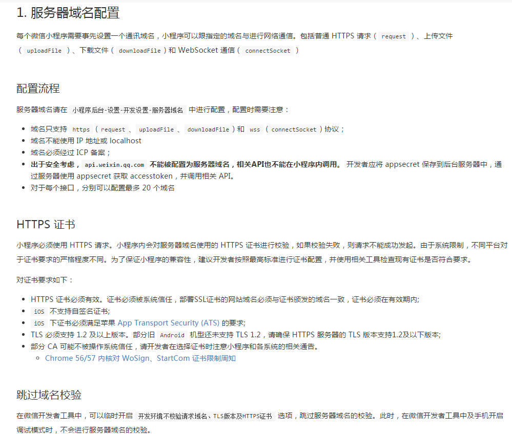
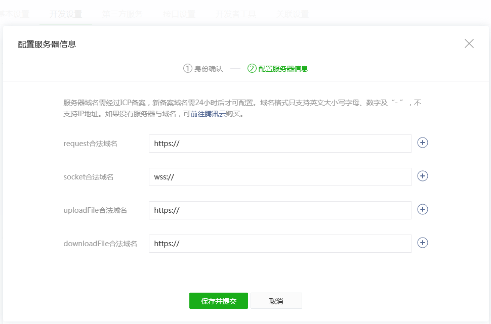
- 小程序申请微信支付(**可选**)：  
  登录小程序—设置—基本设置—微信认证—详情，认证后即可申请支付。
- 绑定微信开放平台帐号：  
  可与帐号下的其他移动应用、网站应用及公众号打通，通过**UnionID**机制满足在多个应用和公众号之间**统一用户帐号**的需求。  
  [登录微信开放平台](https://open.weixin.qq.com)—管理中心—公众帐号—绑定公众帐号

### &ensp;&#8194;4.[安装开发工具](https://developers.weixin.qq.com/miniprogram/dev/devtools/download.html?t=18090422)
- 填入申请到的小程序的AppID
- 开启小程序之旅：
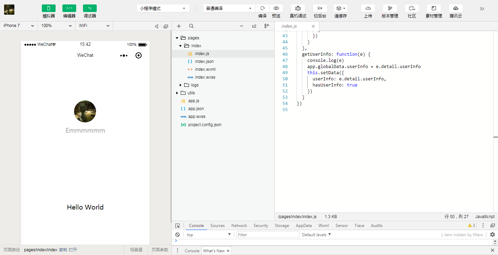
#### 预览：
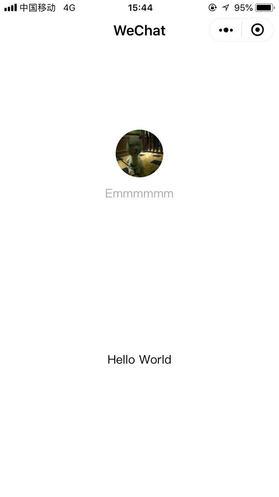

## 二、小程序开发
### &ensp;&#8194;1.上传代码&&发布
- 点击开发者工具顶部操作栏的**上传**按钮，填写版本号以及项目备注
- 登录小程序管理后台 - 开发管理 - 开发版本，将这个版本设置**体验版**或者是**提交审核**
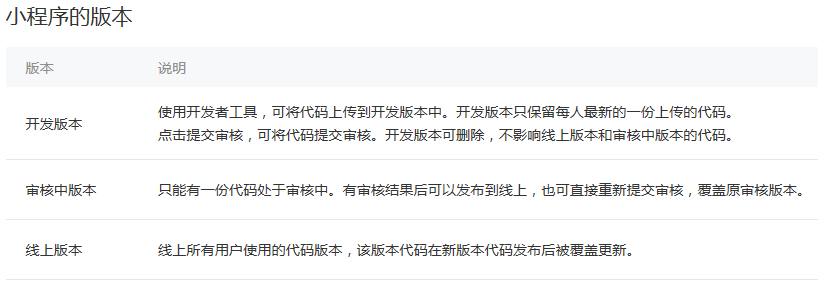
### 2.数据运营
- 有两种方式可以方便的看到小程序的运营数据：  
方法一：  
   登录 小程序管理后台 - 数据分析  
方法二：  
   使用**小程序数据助手**，在微信中方便的查看运营数据(仅可查看**已发布**小程序)
   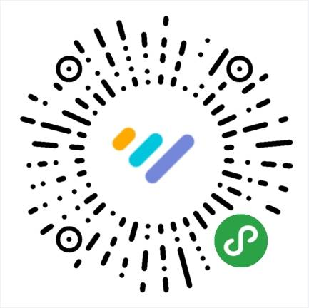
### 3.性能面板
- 在开发版小程序，打开方法：进入开发版小程序，进入右上角更多按钮，点击「显示性能窗口」。
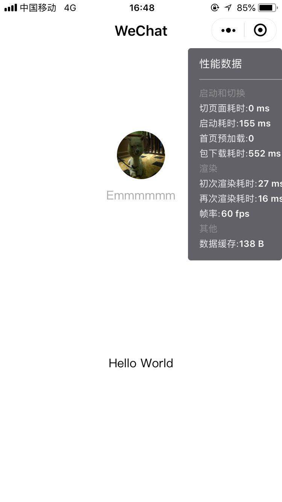
## 三、相关公共接口
### &ensp;&#8194;1.获取 access_token
- 很多重要功能都需要先得到access token,包括：**小程序模板消息**、**小程序客服消息**、**获取小程序二维码**等。
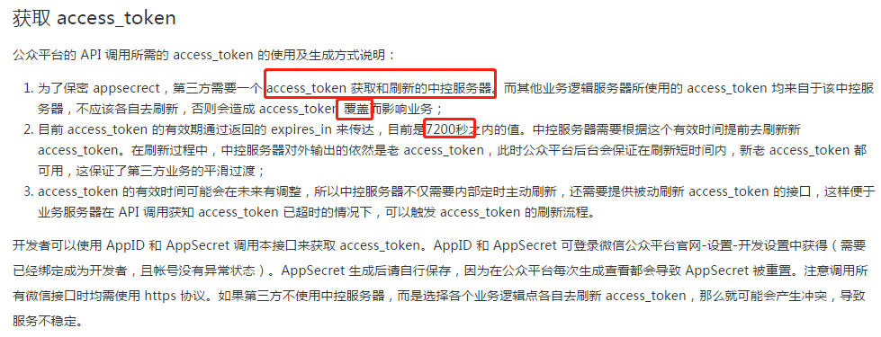
### &ensp;&#8194;2.模板消息
- 为开发者提供了可以高效触达用户的模板消息能力，以便实现服务的闭环并提供更佳的体验，步骤：  
&ensp;&#8194;获取模板ID(接口获取模版ID或平台手动获取)。
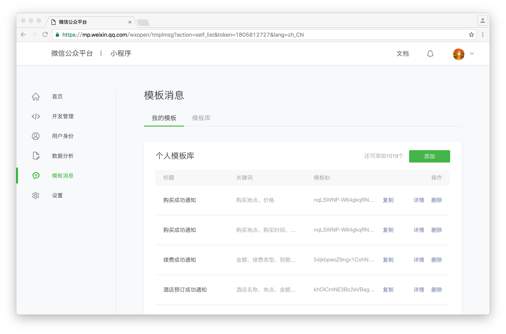
&ensp;&#8194;页面的<form/>组件，属性report-submit为true时，可以声明为需发模板消息，此时点击按钮提交表单可以获取formId，用于发送模板消息。或者当用户完成支付行为，可以获取prepay_id用于发送模板消息。  
&ensp;&#8194;调用接口下发模板消息。  
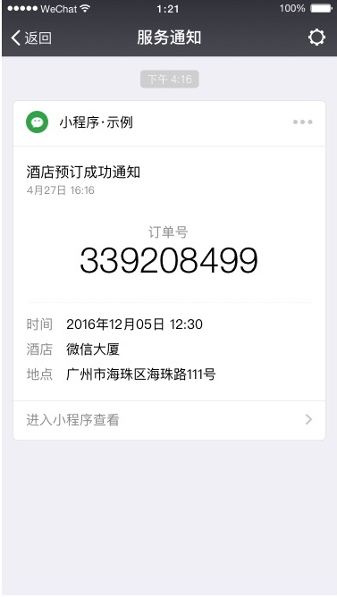
### &ensp;&#8194;3.客服消息
- 当用户在客服会话发送消息（或进行某些特定的用户操作引发的事件推送时），微信服务器会将消息（或事件）的数据包（JSON或者XML格式）POST请求开发者填写的URL。开发者收到请求后可以使用发送客服消息接口进行异步回复。
- 用户在小程序“客服会话按钮”进入客服会话时,一般默认程序返回信息，如：您好，有什么能帮助你?；其他文本信息，图文信息转发到**[网页版客服工具](https://developers.weixin.qq.com/miniprogram/introduction/custom.html#网页版客服工具)**即可。
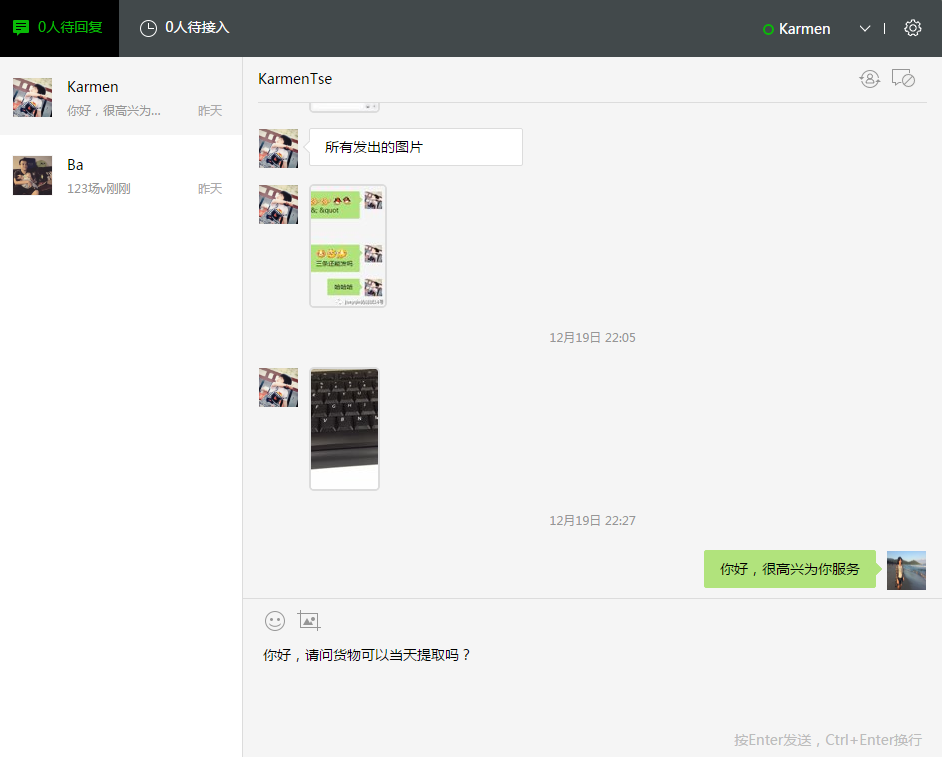
- [接入指引](https://developers.weixin.qq.com/miniprogram/dev/api/custommsg/callback_help.html)：  
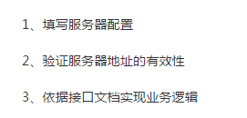
### &ensp;&#8194;4.[生成二维码](https://developers.weixin.qq.com/miniprogram/dev/api/qrcode.html)
- 通过后台接口可以获取小程序任意页面的二维码，扫描该二维码可以直接进入小程序对应的页面
- 根据需求选择不同的生成接口

## 三、小程序与公众号开发区别
### &ensp;&#8194;1.相同点
- 需要AccessToken中控服务器，提供主动刷新和被动刷新机制来刷新accessToken并存储（为了防止并发刷新，注意加并发锁），提供给业务逻辑有效的accessToken
- 客服消息机制一致：如，服务器无法保证在五秒内处理回复，则必须回复“success”或者“”（空串），否则微信后台会发起三次重试。三次重试后，依旧没有及时回复任何内容，系统自动在粉丝会话界面出现错误提示“该公众号暂时无法提供服务，请稍后再试”
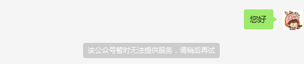
### &ensp;&#8194;2.不同点
- 生成二维码方式不一致：公众号要通过tickit换取二维码，而小程序直接返回二维码文件流
- 小程序[登录流程](https://blog.csdn.net/abcwanglinyong/article/details/80267901)，公众号无此流程：
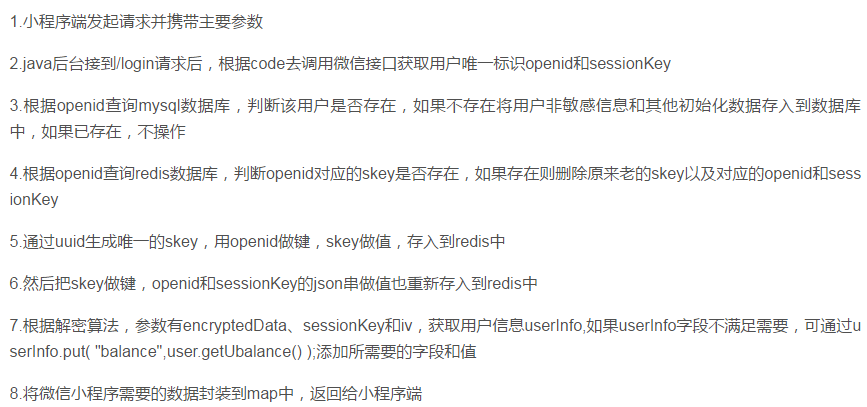
